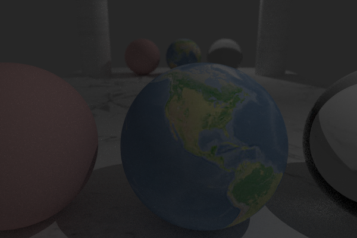

# Pathtracing-Computer-Graphics-2024
Pathtracing C++ implementation for the Computer Graphics Course at The University of Edinburgh. The renderer supports most basic raytracing features as well as some advanced pathtracing functionality. Some of the features supported include (but are not limited to):

- Texture Support
- Shadows
- Reflections & Refractions
- Bounding Volume Hierarchy Acceleration\
- Antialiasing
- BRDF
- Multi-Bounce Path Tracing

A sample image with the features achieved by the renderer is presented below. More images are provided in the "Images" directory

